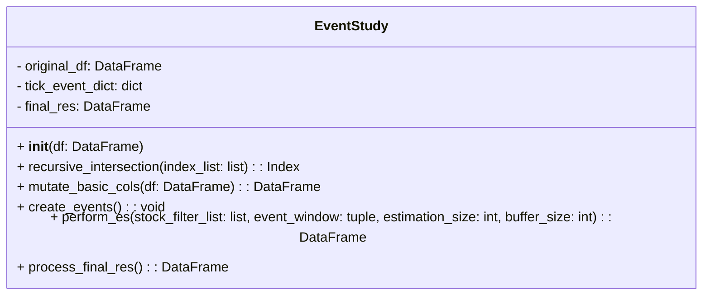

# A. Create ENV
```
conda env create -f ./environment.yml
```

# B. Class Diagram



# C. Basic Operation Flow Chart

## C.0 Make sure these Base data frame are available
Make sure the data frame in ```df``` for creating BaseLine model in ```es_engine.perform_es``` are availble
```
es.Single.import_returns(path=f'your/path/to/df/returns_{tick}.csv', date_format = '%Y-%m-%d')
es.Single.import_FamaFrench(path=f'your/path/to/df/fama_{tick}.csv', date_format = '%Y-%m-%d')
```


## C.1 Initialize Event Study module
df is the pandas dataframe that you  can use to generate your event signal

```
es_engine = esprocess.EventStudy(df)
```


## C.2 Mutate additional column needed for creating events based on your input df
This Static Method is called in the method ```es_engine.create_events()```. Modify this method according to the column you want to mutate

```
es_engine.mutate_basic_cols()
```
## C.3 Create event based on your input data frame 

```
es_engine.create_events()
```
After running this, you will get a dictionary that records the date of each a certain event for each tick in ```self.tick_event_dict```

The default event is the doubling volume of a certain ticker, or you can add your own event rules in the block below 

```
def create_events(self):
    ...
    
    for tick in tqdm(uq_tick,  desc="Looping ticks to create evnets", leave=False):
        df_tick = self.original_df[self.original_df['股號']==tick].reset_index(drop=True)
        
        # Define your events here ###################
        
        # Event1 量起
        event_1 = df_tick[(df_tick['成交量']>500)&(df_tick['volume_delta_1']>2)].index
        
        
        #############################################
    ...

```
## C.4 Run Backtest
With ```self.tick_event_dict``` you can run your backtest ! 

To know more about the params needed in this method please see ```E. Params```

```
es_engine.perform_es(stock_filter_list=PARAMS['stock_filter_list'])
```

## C.5 Transform result to specific format
Run this code to get a dataframe more easy to analysis the behaviour of each ticker
```
res = es_engine.process_final_res()
```

# D. Fastest way to create your own event
- manually update ```self.tick_event_dict``` in the module

- Declare your own class like this: 
```
class MyEventStudy(esprocess.EventStudy):
    def __init__(self, df):
        # Call the parent class's __init__ method
        super().__init__(df)
        self.original_df = df

    def create_events(self):
        # Call the parent class's create_events method
        self.tick_event_dict[f'1101'] = ['2020-04-10']
        self.tick_event_dict[f'1102'] = ['2020-04-10']
```
see more sample code in ```test.ipynb```

# E. Params
- stock filter list (the tick you want to test)
- event window [T2, T3]
- estimation size [T0, T1]
- Buffer size [T1, T2]<br>
    used to estimate $\bar{CAR}(T1, T2)$ and $var(\bar{CAR}(T1, T2))$


- n_signal : the number of the frequency an event appear in a tick
- positive_sig_percent : how many CARs are significant in the post-event window
```
PARAMS = {
    
    'stock_filter_list':['1101', '1102'],
    'event_window':(0,+10),
    'estimation_size':30,
    'buffer_size':30,
    'window_size':10,
    'n_signal':10,
    'positive_sig_percent':0.8

}
```
