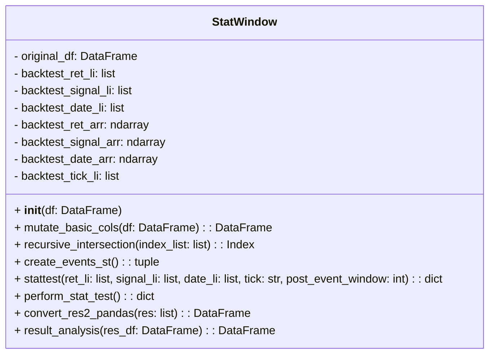

# A. Create ENV
```
conda env create -f ./environment.yml
```

# B. Class Diagram




# C. Basic Operation Flow Chart

## C.1 Initialize StatWindow module
df is the pandas dataframe that you can use to generate your event signal

```
st_engine = stprocess.StatWindow(df)
```

## C.2 Mutate additional column needed for creating events based on your input df
This Static Method is called in the method ```es_engine.create_events()```. Modify this method according to the column you want to mutate

```
st_engine.mutate_basic_cols()
```

## C.3 Create event based on your input data frame 

```
st_engine.create_events()
```
After running this, three array and a list will be updated for backtest
- ```self.backtest_ret_arr``` : a numpy 2d array that stores the return of a specific tiker 
- ```self.backtest_signal_arr```:  a numpy 2d array that stores the event signal of a specific tiker 

- ```self.backtest_date_arr```:  a numpy 2d array that stores the trading date of a specific ticker
- ```self.backtest_tick_li``` : a list that stores the ticker being tested 

The default event is the doubling volume of a certain ticker, or you can add your own event rules in the block below 

```
def create_events(self):
    ...
    
    for tick in tqdm(uq_tick,  desc="Looping ticks to create evnets", leave=False):
        df_tick = self.original_df[self.original_df['股號']==tick].reset_index(drop=True)
        
        # Define your events here ###################
        
        # Event1 量起
        event_1 = df_tick[(df_tick['成交量']>500)&(df_tick['volume_delta_1']>2)].index
        
        # Event2 ...
        # Event3 ...
        
        #############################################
    ...

```

## C.4 Run Backtest
With the folowing objects updated, you can call ```StatWindow.stattest()``` directly.

- ```self.backtest_ret_arr``` : a numpy 2d array that stores the return of a specific tiker 
- ```self.backtest_signal_arr```:  a numpy 2d array that stores the event signal of a specific tiker 

- ```self.backtest_date_arr```:  a numpy 2d array that stores the trading date of a specific ticker
- ```self.backtest_tick_li``` : a list that stores the ticker being tested 


```
res = st_engine.perform_stat_test()
```
or
```
ret, sig, date, tick = st_engine.create_events_st()
res = st_engine.perform_stat_test(ret, sig, date, tick)
``` 