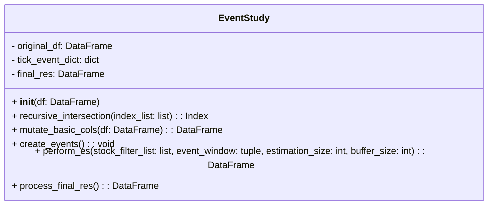

```mermaid
classDiagram
    class EventStudy {
        - original_df: DataFrame
        - tick_event_dict: dict
        - final_res: DataFrame
        + __init__(df: DataFrame)
        + recursive_intersection(index_list: list): Index
        + mutate_basic_cols(df: DataFrame): DataFrame
        + create_events(): void
        + perform_es(stock_filter_list: list, event_window: tuple, estimation_size: int, buffer_size: int): DataFrame
        + process_final_res(): DataFrame
    }
    
```

