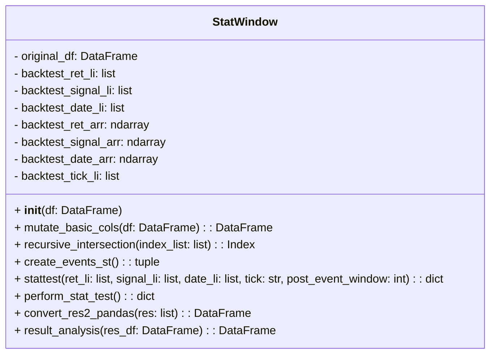

```mermaid
classDiagram
    class StatWindow {
        - original_df: DataFrame
        - backtest_ret_li: list
        - backtest_signal_li: list
        - backtest_date_li: list
        - backtest_ret_arr: ndarray
        - backtest_signal_arr: ndarray
        - backtest_date_arr: ndarray
        - backtest_tick_li: list
        + __init__(df: DataFrame)

        + mutate_basic_cols(df: DataFrame): DataFrame
        + recursive_intersection(index_list: list): Index
        + create_events_st(): tuple
        + stattest(ret_li: list, signal_li: list, date_li: list, tick: str, post_event_window: int): dict
        + perform_stat_test(): dict

        + convert_res2_pandas(res: list): DataFrame
        + result_analysis(res_df: DataFrame): DataFrame        
    }
```

