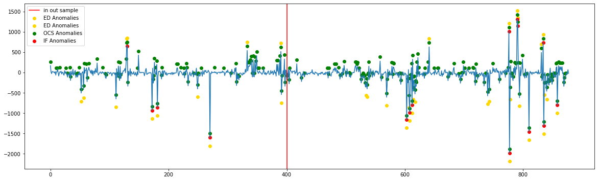
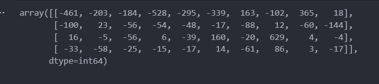
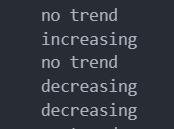
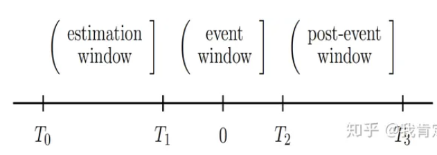
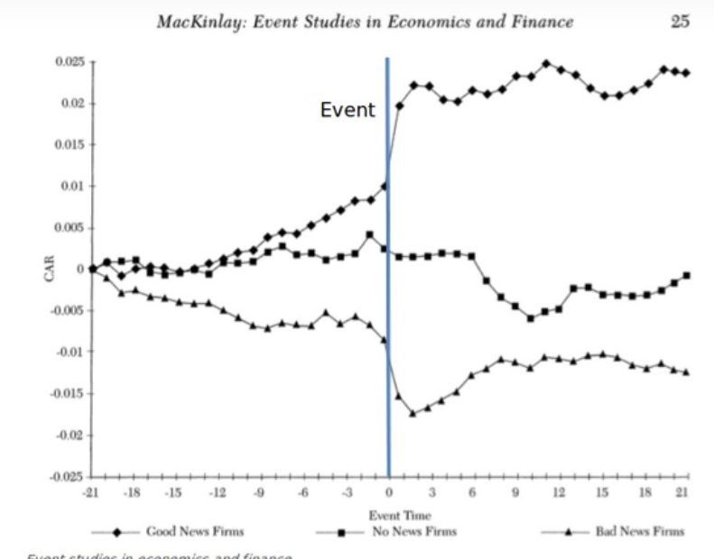
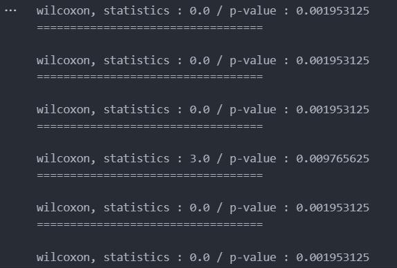
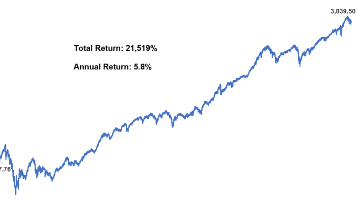

# A. 尋找異常值

## 1. 方法
因為不確定何謂異常，故採取非監督式機器學習方法

- Isolation Forest
- One Class SVM
- Encoder decoder


## 2. 小結
模型的訓練一律採用前400筆資料<br>
神經網路訓練資料有經過標準化，其他兩種則無

- One class SVM 對參數與訓練過於敏感，表現不穩定暫不考慮
- Isolation Forest 對局部異常值較為不敏感
- 神經網路目前看起來表現最好，可以找出一些局部異常值，但是不會太敏感




## 3. 後續改進方向

- Isolation Forest : 調參數
- One Class SVM : 調參數
- Encoder decoder : 調參數，或是直接更改模型架構

# B. 尋找價格模式

## 1. 方法

monotonic trend test：原先用於氣候變遷的趨勢檢定<br>
H0 = 有趨勢 (單調遞增或單調遞減)<br>
H1 = 非H0

## 2. 小結
可以透過此方法

- 找出成交量形成單調遞增或單調遞減趨勢的時間段




- 標記趨勢轉變的時間點




# C. 量起價揚統計驗證

量起定義：

t-1期的成交量>500 且 t期的成交量倍增 (放大至少一倍以上)

$$ volume_{t-1} > 500 \space \space and \space \space \frac{volume_{t}}{volume_{t-1}} > 2 $$


## 1. 價揚驗證方法

### 1.1.1 事件研究法
方法分為兩種，第一種為學術界常用的[方法](https://www.eventstudytools.com/event-study-application-blueprint) ```event study method ``` 。<br>

通常被用於做事件分析 ([例如](https://zhuanlan.zhihu.com/p/104209130)：當政府或是企業宣告了最新的政策方向後，對公司的股價是否有影響)。<br>

當事件(在本報告中，事件被定義為```量起```)發生後，以該事件為中心，框選出一段涵蓋事件發生前後的窗格。

並在這段窗格內計算```累積異常報酬```，最後在對這些
```累積異常報酬``` 做統計檢定，並觀察他的顯著性。





但是計算```累積異常報酬```的方式有很多。可以作為後續研究方向，故目前暫時採取其他方法。

### 1.1.2 其他統計方法

- ```wilcoxon signed rank test```事件發生後的一段時間(10天)，其```報酬率```有沒有顯著不為0。
    - 選擇原因：t 檢定要求常態分配，但是```報酬```不是，故採用此無母數統計方法
    - 虛無假設以及對立假設：

        H0 :  $ \mu_{return} \neq 0 $

        H1 : $ \mu_{return} = 0 $
    - 結論：有顯著不為0
    
    

- ``` Monotonic Trend test```事件發生後的一段時間(10天)，其```累積報酬率```有沒有呈現趨勢。

    - 計算累積報酬是否呈現單調遞增遞減的趨勢

    


    - 結論：有