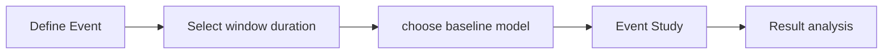

# Event Study 



## 1. Define Event
範例事件：成交量>500 且 隔日成交量放大2倍以上

i.e.  $volume_{t-1} > 500$ and $\frac{volume_{t}}{volume_{t-1}}>2$
```{python}
vol_increase_id = df_tick[(df_tick['成交量']>500)&(df_tick['volume_delta_1']>2)].index
event_date = df_tick['日期'][vol_increase_id].to_list()
```
## 2. Select window duration
- event window [T2, T3]
- estimation size [T0, T1]
- Buffer size [T1, T2]<br>
    used to estimate $\bar{CAR}(T1, T2)$ and $var(\bar{CAR}(T1, T2))$


```{python}
event = es.Single.FamaFrench_3factor(
    security_ticker = str(tick),
    event_date = np.datetime64(str(ed)),
    event_window = (-2,+10), 
    estimation_size = 30, # 注意這個
    buffer_size = 10,
    keep_model=False
)
```
## 3. choose baseline model
- [x] CAPM
- [ ] 3 factor
- [ ] 5 factor
## 4. Event Study module
## 5. Result analysis
- [x] significant percentage in post-event window

